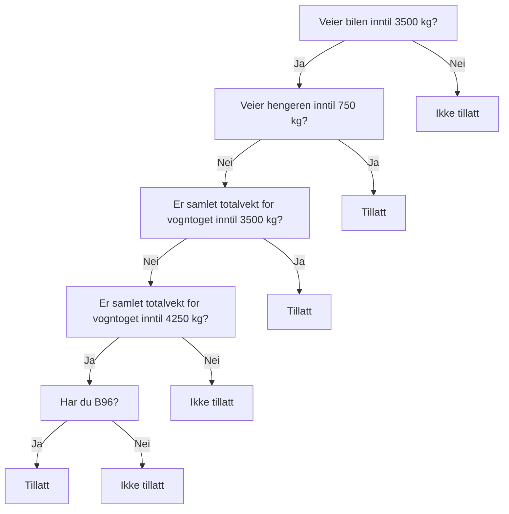

Tilhengerlappen
==

Målet med dette prosjektet er å skrive et kompendium for tilhengerlappen,
som skal hjelpe meg å lære og å forstå det som trengs for å kjøre med tilhenger.

-------------

## Ressurser

- [Hva må jeg kunne? Førerkort klasse B96 / BE, Think Trafikk](https://www.thinktrafikk.no/wp-content/uploads/2021/11/Opplaring-klasse-BE.pdf)
- [Sikring av last i varerom og på tilhengere for kjøretøy under 3500 kg, FoU rapport nr. 29, Nord universitet](https://nordopen.nord.no/nord-xmlui/bitstream/handle/11250/2503971/FoURapport292018.pdf?sequence=1&isAllowed=y)
- [Førerkortforskriften kap. 3, Førerklasser](https://lovdata.no/dokument/SF/forskrift/2004-01-19-298/KAPITTEL_3#KAPITTEL_3)
- [Forskrift om bruk av kjøretøy, kap. 3. Personer og gods](https://lovdata.no/dokument/SF/forskrift/1990-01-25-92/KAPITTEL_4#KAPITTEL_4)
- [Forskrift om bruk av kjøretøy, kap. 4. Trekking av motorvogn, tilhenger](https://lovdata.no/dokument/SF/forskrift/1990-01-25-92/KAPITTEL_5#KAPITTEL_5)

## Huskeregler

### Følg hengeren i speilene

> Hvis hengeren synes mer i høyre speil, sving rattet mot høyre for å rette den opp.
> Hvis hengeren synes mer i venstre speil, sving rattet mot venstre for å rette den opp.

__«Rattet mot det speilet hengeren vises mest = retter opp hengeren»__

### Måle vekt

![vektmåling][vekt]

1. Vekten måles med hengeren fremdeles tilkoblet bilen
2. Bilen kobles i fra, og vekten måles på nytt (aktuell vekt)

Koblingsvekten (vekten på hengerfestet) er differansen mellom måling i 1) og 2).
Lasten på hengeren er differansen mellom måling i 2) og egenvekten til hengeren (se vognkort).

## Lover og regler

### Vektbegrensninger

For å kjøre med tilhenger er det to ting som er begrensende:
- førerkortklassen din
- bilens maksimale tillatte tilhengervekt (O.1 og O.2 i vognkortet)

#### Førekortbegrensninger

Fra [førerkortforskriften § 3-5](https://lovdata.no/forskrift/2004-01-19-298/§3-5):

> Førerett i klasse B gjelder for:
> 1.	Motorvogn (unntatt motorsykkel og moped) med en tillatt totalvekt på høyst 3 500 kg og godkjent for transport av høyst 8 passasjerer i tillegg til fører.
> 2.	Vogntog bestående av motorvogn som omfattes av nr. 1 og tilhenger med tillatt totalvekt på høyst 750 kg.
> 3.	Vogntog bestående av motorvogn som omfattes av nr. 1 og tilhenger med tillatt totalvekt over 750 kg forutsatt at samlet tillatt totalvekt for vogntoget ikke overstiger 3 500 kg.
> 4.	Vogntog bestående av motorvogn som omfattes av nr. 1 og tilhenger med tillatt totalvekt over 750 kg forutsatt at samlet tillatt totalvekt for vogntoget ikke overstiger 4 250 kg og vedkommende har fellesskapskode 96 påført førerkortet.

Oppsummert:
med klasse B kan du kjøre en bil inntil 3500 kg.
Du kan trekke en henger hvis den er inntil 750 kg eller at samlet tillatt vogntogvekt ikke overstiger 3500 kg

Fra [førerkortforskriften § 3-11](https://lovdata.no/forskrift/2004-01-19-298/§3-11):

> Førerett klasse BE gjelder for vogntog bestående av motorvogn som omfattes av § 3-5 første ledd nr. 1 og tilhenger med tillatt totalvekt på høyst 3 500 kg.

Oppsummert: med klasse BE kan tilhengeren veie opp til 3500 kg. 

| Totalvekt bil | Totalvekt tilhenger | Total vogntogvekt | Tillatt med klasse B?                 |
|---------------|---------------------|-------------------|---------------------------------------|
| 3500 kg       | 750 kg              | 4250 kg           | ✅ Ja, jmf. § 3-5 nr. 2                |
| 3500 kg       | 1000 kg             | 4000 kg           | ❌ Nei, ikke uten B96 jmf. § 3-5 nr. 4 |
| 2000 kg       | 1500 kg             | 3500 kg           | ✅ Ja, jmf. § 3-5 nr. 3                |
| 3000 kg       | 2000 kg             | 5000 kg           | ❌ Nei, ikke uten klasse BE            |

#### Bilens begrensninger

> Maksimal vogntogvekt = Tillatt totalvekt bil (F.2) + Tillatt totalvekt tilhenger

Bilen kan trekke tilhengeren dersom «aktuell vekt» (tilhengerens egenvekt + nyttelast) er innenfor 
«Maksvekt tilhenger m/brems (O.1)» (alternativt O.2 om hengeren er uten brems). 

I tillegg må total vogntogvekt være innenfor bilens Maks vogntogvekt (se vognkortet til bilen).
Dette kravet er du innenfor så lenge hengeren er innenfor bilens maksimale tillatte tilhengervekt, så 
fremt bilen i seg selv ikke er fullstappet med last. 
Er du i tvil så kan du veie bilen med hengeren koblet til og påse at vekten er innenfor.

### Dekkdimensjoner

![dekkdimensjoner][dekk]

Man kan her lese at standard dekkdimensjon er 155/R13. (Grønn ramme). 
Dette betyr at dekket er 155 mm bredt og er 13 tommer i diameter.

Videre kan man lese at minstekravet til dekkets bæreevne (LI – LOAD INDEX) er 84 (Rød ramme). 
Dette tilsvarer 500kg. Merk at dette gjelder for hvert enkelt dekk.
Dekkene skal minst ha mønsterdybde 1,6 mm på sommerdekk (eller 3.0 mm på vinterstid) og 3,0 mm på vinterdekk.

| Lasteindeks | Last i kg per dekk |
|-------------|--------------------|
| 70          | 335                |
| 71          | 345                |
| 72          | 355                |
| 73          | 365                |
| 74          | 375                |
| 75          | 387                |
| 76          | 400                |
| 77          | 412                |
| 78          | 425                |
| 79          | 437                |
| 80          | 450                |
| 81          | 462                |
| 82          | 475                |
| 83          | 487                |
| 84          | 500                |
| 85          | 515                |
| 86          | 530                |
| 87          | 545                |
| 88          | 560                |
| 89          | 580                |
| 90          | 600                |
| 91          | 615                |
| 92          | 630                |
| 93          | 650                |
| 94          | 670                |
| 95          | 690                |
| 96          | 710                |
| 97          | 730                |
| 98          | 750                |
| 99          | 775                |
| 100         | 800                |
| 101         | 825                |
| 102         | 850                |
| 103         | 875                |
| 104         | 900                |
| 105         | 925                |
| 106         | 950                |
| 107         | 975                |
| 108         | 1000               |
| 109         | 1030               |
| 110         | 1060               |

### Lastsikringsregler

Fra [Forskrift om bruk av kjøretøy § 3-2](https://lovdata.no/forskrift/1990-01-25-92/§3-2):

> Gods skal være plassert slik at føreren har tilstrekkelig utsyn og ikke hindres i å manøvrere forsvarlig. Verken påbudt lys eller kjennemerker må være tildekket.
>
> Godsets vekt skal være mest mulig jevnt fordelt på hjul på samme aksel og hensiktsmessig fordelt mellom akslene. Minst 20 % av kjøretøyets aktuelle totalvekt skal hvile på styrende hjul.  
> 
> Gods skal være sikret slik at det ikke utgjør en trussel for helse, eiendom eller miljøet. Sikringen skal hindre at godset verken kan
> a. virke forstyrrende på sikker kjøring  
> b. falle av kjøretøyet eller slepe på vegen,  
> c. virke forstyrrende for andre trafikanter, eller  
> d. ryke, støve, fremkalle unødig støy eller på annen måte være til sjenanse for omgivelsene.  
> Det samme gjelder kjetting, tau, presenning og annet festemiddel.

Oppsummerig: godset må ikke blokkere speil eller hindre sikt. 
Det tyngste godset skal være i bunn og mest mulig sentrert på tilhengeren, med lik fordeling på hjulene.

Det skal ikke være mulig at godset kan flakse av i fart, kan hekte seg i andre trafikanter, osv. Grus/stein/jord kan ryke og støve, her må det vurderes å bruke netting/presenning over.

---

Fra [Forskrift om bruk av kjøretøy § 3-3 nr. 1](https://lovdata.no/forskrift/1990-01-25-92/§3-3):

> Under transport skal gods på kjøretøy være sikret slik at lastenheter kun minimalt kan endre posisjon i forhold til hverandre, mot vegger eller mot andre flater i kjøretøyet, og ikke kan flytte seg utenfor lasterommet eller lasteflaten.

Oppsummering: godset skal altså ikke være løst eller ha mulighet for å bevege seg. Det skal være festet godt.

---

Fra [Forskrift om bruk av kjøretøy § 3-3 nr. 3](https://lovdata.no/forskrift/1990-01-25-92/§3-3):

> Ved sikring av last […] skal sikringen minst tåle følgende krefter:   
> a.	I kjøreretningen: 1,0 ganger godsets vekt  
> c.	Sideveis og mot kjøreretningen: 0,5 ganger godsets vekt  
>       Sikringen skal også hindre at lasten kan helle eller velte.

Oppsummering: sikringen, f.eks. stroppene, skal minst tåle godsets vekt. Om godset veier 1000 kg må altså stroppen minst ha 1000 kg Lacing Capacity

---

Fra [Forskrift om bruk av kjøretøy § 3-3 nr. 4 bokstav a](https://lovdata.no/forskrift/1990-01-25-92/§3-3):

> Gods skal sikres ved låsing, blokkering, direkte surring, overfallssurring eller ved kombinasjon av disse metoder. 
> Andre metoder kan godtas hvis det det ved beregninger eller praktiske prøver kan sannsynliggjøres at den anvendte metode oppfyller kravene i nr. 3.

Oppsummering: 

* Låsing: Hva menes med dette? Finner lite informasjon om dette.
* Blokkering/Stempling: brukes til å sikre godsets krefter mot å forskyve seg i alle retninger ved å fylle tomrom, og brukes oftest i kombinasjon med surring
* Surring:
  *	Overfallssurring: Jekken går fra den ene siden av tilhengeren, over lasten og ned på den andre. Brukes hovedsakelig til å sikrekreftene sideveis (50% av godsets vekt begge sider)
  *	Grimesurring: Grimesurring er en surring som er svært egnet til å sikre for krefter i fartsretningen. Stroppen blir som en grime på en hest, og festes i gulvet på hengeren, opp på lasten med maksimalt 45 graders vinkel, rundt forsiden og ned på den andre siden i gulvet
  *	Loopsurring: Ved bruk av loopsurring skal 2 stroppepar benyttes for å unngå at lasten vrir seg løs. Brukes til sikring av godsets krefter sideveis og ofte i kombinasjon med stengning.
  *	Direkte surring: Direkte surring er en svært effektiv surremetode. Den forutsetter at en har noen surrefester i selve godset

NB! Ikke surr stroppene rundt lastelemmene eller karmene på hengeren.  
Hekter du stroppen på utsiden av hengeren, drar den over lasten og strammer til, kan du bøye og skade karmene

Det anbefales ikke fiberstropper med sterkere bruddstyrke enn 2000 kg Lashing
Force (to tonn stropp), og grunnen er at den forstramming som oppnår når båndet
strammes med jekkestrammeren kan bli for høy i forhold til styrken i
surrekroken i tilhengeren, som kan medføre at surrekroken ryker.

Stempling:  
![stempling][stempling]

Overfallssurring:  
![overfallssurring][overfallssurring]

Grimesurring:  
![grimesurring][grimesurring]

Loopsurring:  
![loopsurring][loopsurring]

Direktesurring:  
![direktesurring][direktesurring]

---

Fra [Forskrift om bruk av kjøretøy § 3-3 nr. 5](https://lovdata.no/forskrift/1990-01-25-92/§3-3):

> Kjøretøykomponenter som benyttes til lastsikring skal ikke belastes med større krefter enn de er beregnet/dokumentert/konstruert for.

Oppsummering: det må brukes ordentlig festemidler. Et tau er f.eks. ikke godt nok, mens stropper er bra.
En stropp med 1000 daN Lacing Capacity (LC) skal tåle 1000 kg under bruk. LC viser til hva stroppen minimum tåler i brukt tilstand

![stroppe][stroppe]
Bildet viser en stropp med 1000 dekanewton (1000 kg) Lacing Capacity.  
Som ny vil denne stroppen sannsynligvis tåle 2000 daN (kg). 
Merkingen viser videre at stroppens som helhet inklusive metalldeler har en 
bruddstyrke på 1000 daN (kg) i rett strekk og 2000 daN (kg) brukt som overfall

---

Fra [Forskrift om bruk av kjøretøy § 3-3 nr. 6](https://lovdata.no/forskrift/1990-01-25-92/§3-3):

> Hvis det er mulig på grunn av godsets beskaffenhet og dimensjoner, skal surring på kjøretøy med åpent godsrom anbringes innenfor sidelemmer eller lignende. Er dette ikke mulig, må alle deler av surringen være festet slik at løse ender ikke kan skade annen trafikant.

Oppsummering: surringen skal ligge oppi hengeren. Hvis hengeren ikke har høye sider så må surringen festes slik at den ikke kan skade andre.

---

Fra [Forskrift om bruk av kjøretøy § 3-3 nr. 7](https://lovdata.no/forskrift/1990-01-25-92/§3-3):

> Plater skal ikke stikke utenfor lastbærerens sider i bredderetningen.

Oppsummering: plater, f.eks. gipsplater, skal ligge innenfor hengeren.

---

Fra [Forskrift om bruk av kjøretøy § 3-3 nr. 8](https://lovdata.no/forskrift/1990-01-25-92/§3-3):

> Godsbærer skal være festet til kjøretøyet på en slik måte at den ved full belastning kan tåle det som kreves etter nr. 2 eller 3.  
> Anordning som begrenser godsrom, skal være påsatt og forsvarlig sikret under kjøring.

Oppsummering: lasteplanet / skapet på tilhengeren skal også være forsvarlig festet, f.eks. med høystyrkebolter. Mest relevant for folk som f.eks. har bygget egen lasteplan på hengeren.

### Merking av gods

Fra [Forskrift om bruk av kjøretøy § 3-4 nr. 1 bokstav a](https://lovdata.no/forskrift/1990-01-25-92/§3-4):

> For transporter med bredde inntil 2,55 meter inkludert gods, må godset ikke strekke seg mer enn 15 cm utenfor kjøretøyets sider uten tillatelse fra Statens vegvesen.   
> Tilsvarende gjelder for gods som stikker ut mer enn 1,00 meter foran kjøretøyet.

![utstikkende gods][utstikkende_gods]

Oppsummering: maksimal bredde er 2,55 m. 
Gods kan ikke strekke seg mer enn 15 cm utenfor bilen, eller 1 meter foran bilen, uten tillatelse fra Statens vegvesen.

---

Fra [Forskrift om bruk av kjøretøy § 3-4 nr. 1 bokstav b](https://lovdata.no/forskrift/1990-01-25-92/§3-4):

> Transport av båt med bredde inntil 2,55 meter tillates selv om båten stikker mer 
> enn 15 cm utenfor kjøretøyets sider.  
> Avstanden fra baklysets ytterkant til båtens ytterste kant skal ikke overstige 40 cm. 
> Det samme gjelder reflekser bak på tilhengeren.  
> Det samme kravet gjelder for markeringslys dersom slikt lys er montert foran på kjøretøyet. 
> Dersom kjøretøyet ikke er utstyrt ned markeringslykt tillates transport kun i dagslys med god sikt.  
> Båtens baug skal være plassert i kjøreretningen.

![båt][båt]

Oppsummering: Båt, med maksimal bredde på 2,55 m, kan stikke lenger ut enn 15 cm fra kjøretøyet, 
men avstanden mellom båtens ytterste kant og baklysets (på tilhengerens) ytterste kant 
kan ikke være mer enn 40 cm.

---

Fra [Forskrift om bruk av kjøretøy § 3-4 nr. 2](https://lovdata.no/forskrift/1990-01-25-92/§3-4):

> Merking av gods som stikker ut i bredderetningen:  
> 
> Gods som strekker seg 15 cm eller mer utenfor kjøretøyets sider, 
> skal foran og bak være tydelig merket. 
> Merkingen skal være minst 50 cm høy og minst 25 cm bred og utført med   
> avvekslende røde og gule striper som skal være skråstilt og ca. 5 cm brede.   
> Fargen skal være varig fluoriserende eller av type som er godkjent av Vegdirektoratet.  
>
> Gods som strekker seg utenfor kjøretøyets sider, skal i mørke eller usiktbart vær også foran på 
> hver side være merket med minst to lykter som gir hvitt lys fremover, og bak på hver side 
> med minst to lykter som gir rødt lys bakover. Lyktene skal ha en lysåpning 
> på minst 30 cm^2 og være plassert over hverandre. 
> Lyset må ikke virke blendende og skal være godt synlig på minst 150 meter avstand.  
>
> Merking og lykter skal være plassert ytterst på godset og slik at de er godt synlige forfra og bakfra. 
> Om mulig må overkant av merking og lykter ikke være høyere enn 2,00 meter over vegbanen.

Oppsummering:
Gods utenfor tilhengeren skal i mørke eller dårlig sikt alltid merkes, 
med minst to lykter foran (en på hver side) med hvitt lys og 
minst to lykter bak (en på hver side) med rødt lys.

Gods over 15 cm ut fra sidene (husk: etter godkjenning fra Statens vegvesen) 
skal være merket med røde og gule skråstilte striper foran og bak.
Merkingen må være minst 50 cm høy og 25 cm bred.

Eksempel på god merking av gods som stikker ut i bredden:

![en markfør for bred last][markør_bred_last]

---

Fra [Forskrift om bruk av kjøretøy § 3-4 nr. 23](https://lovdata.no/forskrift/1990-01-25-92/§3-4):

> Merking av gods som stikker ut i lengderetningen:
>
> Gods som stikker ut foran kjøretøyet eller mer enn 1,00 meter bak kjøretøyet, 
> skal være merket ytterst med en anordning som har avvekslende rød og hvit farge og 
> fra alle sider har et synlig areal på minst 250 cm^2. 
> Det røde materialet skal være lysreflekterende. 
> Anordningen skal være plassert slik at den er godt synlig.
> 
> Ved tilfeldig transport kan merkingen skje på annen tydelig måte.
> 
> I mørke eller usiktbart vær skal gods som stikker ut mer enn 1,00 meter bak kjøretøyet 
> også merkes med lykt som gir rødt lys bakover og til sidene. 
> Lykten skal ha lysåpning på minst 30 cm^2. 
> Lyset må ikke virke blendende og skal være godt synlig på minst 150 meter avstand.

![utstikkende i gods i lengden][utstikkende_gods_lengden]

Oppsummering:
Hvis godset stikker ut foran bilen, eller mer enn 1 m bak fra kjøretøyet, skal det merkes 
med anordning som har avvekslende rød og hvit farge på minst 250 cm^2. 
Det røde materialet må være lysreflekterende, og anordningen må være plassert slik at den er godt synlig. 

En plastpose kan godtas.

I mørke eller dårlig sikt skal godset også merkes med lykt, som gir rødt lys bakover og til sidene,
med lysåpning på minst 30 cm^2, som er godt synlig på minst 150 meter avstand.

Eksempel på en anordning som kan brukes for å merke godset i lengderetningen:

![en markfør i lengderetningen][markør_lengderetning]

Eksempel på merking av lang last:  
![kjøretøy med riktig merking][eksempel_lang_last]

---

[vekt]: img/vekt.png "Vektmåling av tilhenger"
[dekk]: img/dekk.png "Dekkdimensjoner for tilhenger"
[stempling]: img/stempling.png "Stempling av last"
[overfallssurring]: img/overfallssurring.png "Overfallssurring av last"
[grimesurring]: img/grimesurring.png "Grimesurring av last"
[loopsurring]: img/loopsurring.png "Loopsurring av last"
[direktesurring]: img/direktesurring.png "Direkte surring av last"
[stroppe]: img/stroppe.png "Kraftverdier for stroppe"
[utstikkende_gods]: img/utstikkende_gods.png "Utstikkende gods i bredden"
[utstikkende_gods_lengden]: img/utstikkende_gods_lengden.png "Utstikkende gods i lengden"
[båt]: img/baat.png "Båt som stikker ut"
[markør_lengderetning]: img/markor_lengderetning.png "Markør for utstikkende gods i lengderetning"
[markør_bred_last]: img/markor_bred_last.png "Markør for bred last"
[eksempel_lang_last]: img/eksempel_lang_last.png "Eksempel på lang last"
