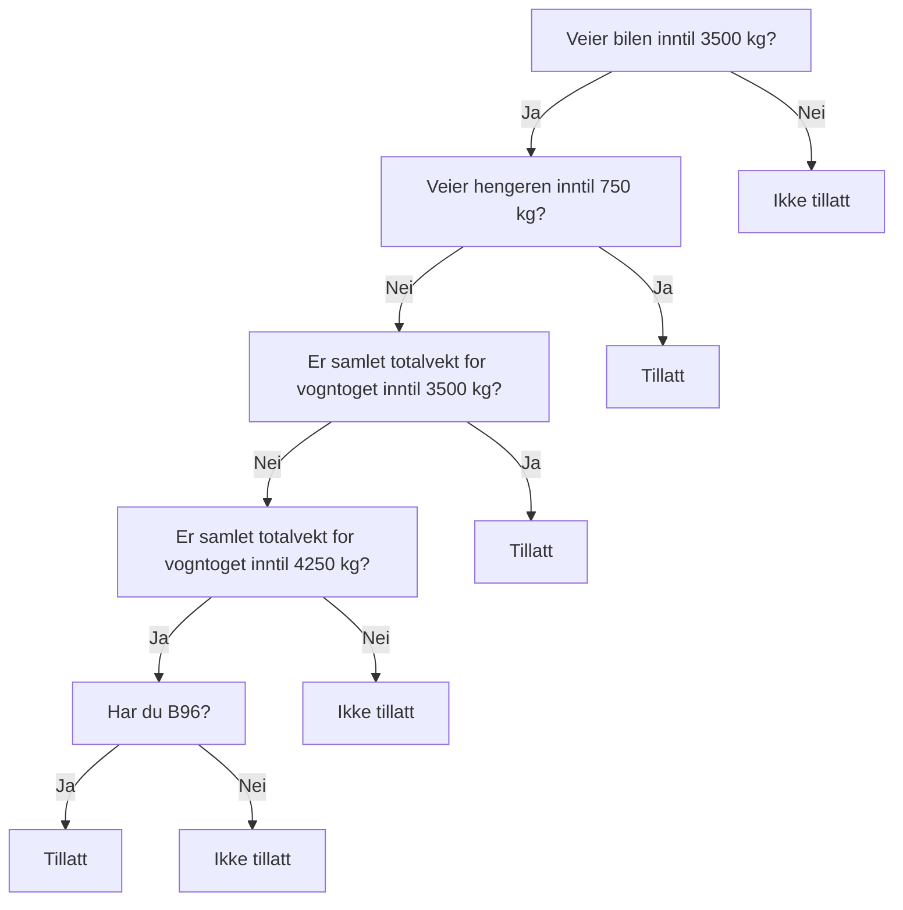

Tilhengerlappen
==

Målet med dette prosjektet er å skrive et kompendium for tilhengerlappen,
som skal hjelpe meg å lære og å forstå det som trengs for å kjøre med tilhenger.

-------------

## Ressurser

- [Hva må jeg kunne? Førerkort klasse B96 / BE, Think Trafikk](https://www.thinktrafikk.no/wp-content/uploads/2021/11/Opplaring-klasse-BE.pdf)
- [Sikring av last i varerom og på tilhengere for kjøretøy under 3500 kg, FoU rapport nr. 29, Nord universitet](https://nordopen.nord.no/nord-xmlui/bitstream/handle/11250/2503971/FoURapport292018.pdf?sequence=1&isAllowed=y)
- [Førerkortforskriften kap. 3, Førerklasser](https://lovdata.no/dokument/SF/forskrift/2004-01-19-298/KAPITTEL_3#KAPITTEL_3)
- [Forskrift om bruk av kjøretøy, kap. 3. Personer og gods](https://lovdata.no/dokument/SF/forskrift/1990-01-25-92/KAPITTEL_4#KAPITTEL_4)
- [Forskrift om bruk av kjøretøy, kap. 4. Trekking av motorvogn, tilhenger](https://lovdata.no/dokument/SF/forskrift/1990-01-25-92/KAPITTEL_5#KAPITTEL_5)

## Huskeregler

### Følg hengeren i speilene

> Hvis hengeren synes mer i høyre speil, sving rattet mot høyre for å rette den opp.
> Hvis hengeren synes mer i venstre speil, sving rattet mot venstre for å rette den opp.

__«Rattet mot det speilet hengeren vises mest = retter opp hengeren»__

### Måle vekt

![vektmåling][vekt]

1. Vekten måles med hengeren fremdeles tilkoblet bilen
2. Bilen kobles i fra, og vekten måles på nytt (aktuell vekt)

Koblingsvekten (vekten på hengerfestet) er differansen mellom måling i 1) og 2).
Lasten på hengeren er differansen mellom måling i 2) og egenvekten til hengeren (se vognkort).

## Lover og regler

### Vektbegrensninger

For å kjøre med tilhenger er det to ting som er begrensende:
- førerkortklassen din
- bilens maksimale tillatte tilhengervekt (O.1 og O.2 i vognkortet)

#### Førekortbegrensninger

Fra [førerkortforskriften § 3-5](https://lovdata.no/forskrift/2004-01-19-298/§3-5):

> Førerett i klasse B gjelder for:
> 1.	Motorvogn (unntatt motorsykkel og moped) med en tillatt totalvekt på høyst 3 500 kg og godkjent for transport av høyst 8 passasjerer i tillegg til fører.
> 2.	Vogntog bestående av motorvogn som omfattes av nr. 1 og tilhenger med tillatt totalvekt på høyst 750 kg.
> 3.	Vogntog bestående av motorvogn som omfattes av nr. 1 og tilhenger med tillatt totalvekt over 750 kg forutsatt at samlet tillatt totalvekt for vogntoget ikke overstiger 3 500 kg.
> 4.	Vogntog bestående av motorvogn som omfattes av nr. 1 og tilhenger med tillatt totalvekt over 750 kg forutsatt at samlet tillatt totalvekt for vogntoget ikke overstiger 4 250 kg og vedkommende har fellesskapskode 96 påført førerkortet.

Oppsummert:
med klasse B kan du kjøre en bil inntil 3500 kg.
Du kan trekke en henger hvis den er inntil 750 kg eller at samlet tillatt vogntogvekt ikke overstiger 3500 kg

Fra [førerkortforskriften § 3-11](https://lovdata.no/forskrift/2004-01-19-298/§3-11):

> Førerett klasse BE gjelder for vogntog bestående av motorvogn som omfattes av § 3-5 første ledd nr. 1 og tilhenger med tillatt totalvekt på høyst 3 500 kg.

Oppsummert: med klasse BE kan tilhengeren veie opp til 3500 kg. 

| Totalvekt bil | Totalvekt tilhenger | Total vogntogvekt | Tillatt med klasse B?                 |
|---------------|---------------------|-------------------|---------------------------------------|
| 3500 kg       | 750 kg              | 4250 kg           | ✅ Ja, jmf. § 3-5 nr. 2                |
| 3500 kg       | 1000 kg             | 4000 kg           | ❌ Nei, ikke uten B96 jmf. § 3-5 nr. 4 |
| 2000 kg       | 1500 kg             | 3500 kg           | ✅ Ja, jmf. § 3-5 nr. 3                |
| 3000 kg       | 2000 kg             | 5000 kg           | ❌ Nei, ikke uten klasse BE            |

#### Bilens begrensninger

> Maksimal vogntogvekt = Tillatt totalvekt bil (F.2) + Tillatt totalvekt tilhenger

Bilen kan trekke tilhengeren dersom «aktuell vekt» (tilhengerens egenvekt + nyttelast) er innenfor 
«Maksvekt tilhenger m/brems (O.1)» (alternativt O.2 om hengeren er uten brems). 

I tillegg må total vogntogvekt være innenfor bilens Maks vogntogvekt (se vognkortet til bilen).
Dette kravet er du innenfor så lenge hengeren er innenfor bilens maksimale tillatte tilhengervekt, så 
fremt bilen i seg selv ikke er fullstappet med last. 
Er du i tvil så kan du veie bilen med hengeren koblet til og påse at vekten er innenfor.

### Dekkdimensjoner

![dekkdimensjoner][dekk]

Man kan her lese at standard dekkdimensjon er 155/R13. (Grønn ramme). 
Dette betyr at dekket er 155 mm bredt og er 13 tommer i diameter.

Videre kan man lese at minstekravet til dekkets bæreevne (LI – LOAD INDEX) er 84 (Rød ramme). 
Dette tilsvarer 500kg. Merk at dette gjelder for hvert enkelt dekk.
Dekkene skal minst ha mønsterdybde 1,6 mm på sommerdekk (eller 3.0 mm på vinterstid) og 3,0 mm på vinterdekk.

| Lasteindeks | Last i kg per dekk |
|-------------|--------------------|
| 70          | 335                |
| 71          | 345                |
| 72          | 355                |
| 73          | 365                |
| 74          | 375                |
| 75          | 387                |
| 76          | 400                |
| 77          | 412                |
| 78          | 425                |
| 79          | 437                |
| 80          | 450                |
| 81          | 462                |
| 82          | 475                |
| 83          | 487                |
| 84          | 500                |
| 85          | 515                |
| 86          | 530                |
| 87          | 545                |
| 88          | 560                |
| 89          | 580                |
| 90          | 600                |
| 91          | 615                |
| 92          | 630                |
| 93          | 650                |
| 94          | 670                |
| 95          | 690                |
| 96          | 710                |
| 97          | 730                |
| 98          | 750                |
| 99          | 775                |
| 100         | 800                |
| 101         | 825                |
| 102         | 850                |
| 103         | 875                |
| 104         | 900                |
| 105         | 925                |
| 106         | 950                |
| 107         | 975                |
| 108         | 1000               |
| 109         | 1030               |
| 110         | 1060               |

[vekt]: img/vekt.png "Vektmåling av tilhenger"
[dekk]: img/dekk.png "Dekkdimensjoner for tilhenger"
